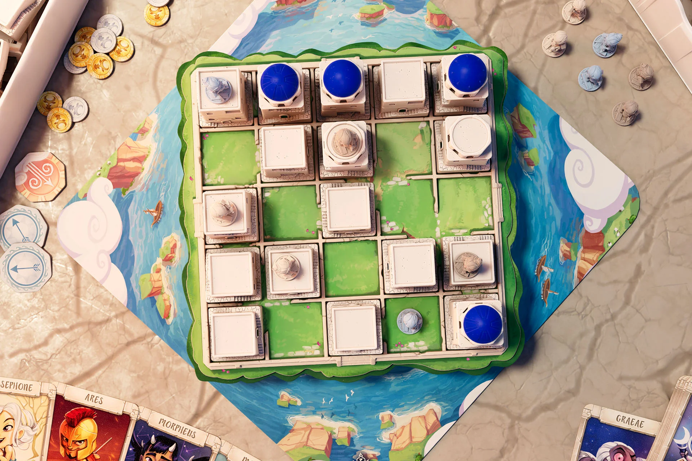

# SantoriniAI

## Creating some AIs to play the board game, [Santorini](https://boardgamegeek.com/boardgame/194655/santorini)

**_Notes:_** 
 - I do not claim any affiliation with Santorini. All credit goes to the developers.
 - This repo is a simplified take on the [SantoriniBot](https://github.com/triskit124/SantoriniBot) by [triskit124](https://github.com/triskit124)

### Agent:
- **MiniMaxAgent**
  - See `MiniMax.py` for implementation. 
  - Implements mini-max search with alpha-beta pruning.
  - Enumerates every possible state to a certain depth and assumes you take optimal actions every turn!
  - Plays a decent game but plays very conservatively and can only look a few turns ahead.

### Launch the game: 
- Play against MiniMaxAgent: `python3 Game.py`
- Play against other Human: `python3 Game.py --blue_player Human`
- Make MiniMaxAgent play alone: `python3 Game.py --green_player MiniMax`

### Controls:
For either moving or building:
- click on the opening window
